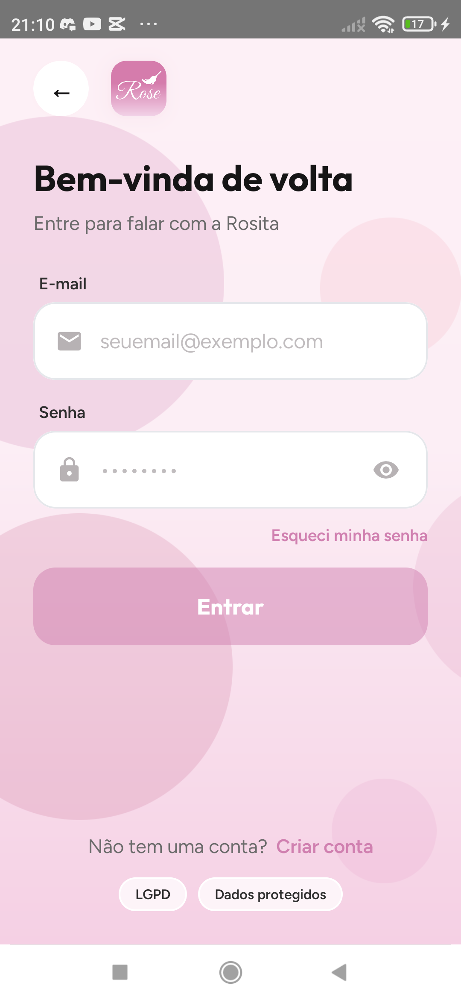

<p align="center">
  
</p>

<h1 align="center">Rose Faxina — Showcase</h1>

<p align="center">
  <strong>Limpeza residencial com carinho</strong><br />
  Marketplace que conecta quem precisa de faxina, profissionais de confiança e a equipe admin.
</p>

<p align="center">
  <a href="https://rosefaxina.com/">rosefaxina.com</a>
  ·
  WhatsApp <a href="https://wa.me/5564999601220">(64) 99960-1220</a>
  ·
  <a href="https://github.com/melker22/Rose-Faxina-Site">código do site</a>
</p>


> **Vitrine pública.** O código do app fica em repositório privado. Aqui estão o produto, a stack, prints reais e o site.

---

## Preview

<p align="center">
  
  &nbsp;
  
  &nbsp;
  
  &nbsp;
  
</p>

<p align="center"><sub>Welcome · Login · Chat da Rosita (cliente) · Home do profissional — prints no Redmi 9</sub></p>

---

## Sobre

O **Rose Faxina** é um marketplace de limpeza residencial. O cliente pede a faxina e paga no app; profissionais próximos recebem a oferta; o primeiro aceite captura o pagamento; o acompanhamento é em tempo real.

| Papel | O que faz |
|--------|-----------|
| **Cliente** | Cadastro + LGPD, solicita faxina, paga (PIX ou cartão), acompanha no mapa e avalia |
| **Faxineiro(a)** | Fica online, recebe ofertas no raio, aceita o pedido, atualiza status e compartilha GPS |
| **Admin** | Pedidos, disputas, precificação e estatísticas — no app e no painel web |

| Plataforma | Status |
|------------|--------|
| **Android** | App principal (Compose Multiplatform) |
| **iOS** | Módulo `shared` preparado |
| **Admin web** | Painel HTML servido pelo Ktor |

Serviços: Limpeza Básica · Limpeza Completa · Faxina Pesada · Mineiros, GO · suporte seg–sáb 7h–20h.

---

## Funcionalidades

- Precificação por m², cômodos, banheiros e extras
- Pagamento no app via **Mercado Pago** Checkout Transparente (PIX + cartão)
- Ofertas geográficas para faxineiros (raio configurável, padrão ~15 km)
- Rastreamento em tempo real (**WebSocket** + mapa no Android)
- Disputas pausam o repasse ao profissional
- **LGPD**: consentimentos no cadastro; exportação e exclusão na API
- Sessão persistente no Android (EncryptedSecureStore)
- Recuperação de senha com código de 6 dígitos

---

## Fluxo MVP

1. Cliente cadastra, aceita LGPD, cria o pedido e confirma o pagamento  
2. Faxineiros próximos recebem a oferta (fila Redis)  
3. O primeiro aceite captura o pagamento  
4. Status: **A caminho** → **No local** → **Em execução** → **Concluído**  
5. Cliente acompanha por WebSocket e mapa  
6. Avaliação; disputas pausam o repasse  

---

## Arquitetura

```text
┌─────────────────────┐     REST + WS      ┌──────────────────┐
│  App KMP (Compose)  │ ─────────────────► │  Ktor + JWT      │
│  Android (+ iOS)    │                    │  Pricing · MP    │
└─────────────────────┘                    │  Push · Tracking │
        │                                  └────────┬─────────┘
        │ Maps + GPS                                │
        ▼                                           ▼
   Google Maps                            PostgreSQL 16 + PostGIS
                                          Redis 7
```

| Módulo | Função |
|--------|--------|
| `shared/` | UI Compose, ViewModels, cliente HTTP, modelos |
| `androidApp/` | Entry Android, mapa, GPS, DI |
| `server/` | API Ktor, Postgres/PostGIS, Redis, JWT, painel `/admin` |
| `iosApp/` | Target iOS preparado |

---

## Stack

| Camada | Tecnologia |
|--------|------------|
| Linguagem | Kotlin 2.1 · JDK 17 |
| UI | Compose Multiplatform · Material 3 |
| App Android | minSdk 26 · compileSdk 35 · Koin · Google Maps |
| API | Ktor (Netty) · JWT · BCrypt · Flyway · Exposed |
| Dados | PostgreSQL 16 + PostGIS · Redis 7 · Docker Compose |
| Pagamentos | Mercado Pago Checkout Transparente |
| Build | Gradle 8.11 · version catalog |

---

## Design

Paleta (tokens da marca Rosita):

| Token | Hex | Uso |
|-------|-----|-----|
| Fundo / wash | `#FCEEF5` | Telas e blobs |
| Primário / logo | `#D080B0` | Marca, nav ativa |
| CTA | `#B84472` → `#E08AB8` | Botões Entrar / Fechar pedido |
| Texto | `#161516` | Títulos |
| Secundário | `#6B6B6B` | Apoio |

Mascote **Rosita** · ícones vetoriais · CTA framboesa · dock no chat.

---

## Links

- Site: [rosefaxina.com](https://rosefaxina.com/)
- WhatsApp: [(64) 99960-1220](https://wa.me/5564999601220)
- Instagram: [@rosefaxina.servicos](https://www.instagram.com/rosefaxina.servicos/)
- Código do site: [Rose-Faxina-Site](https://github.com/melker22/Rose-Faxina-Site)
- Autor: [Melker Halberd Pereira Alves](https://github.com/melker22) · Mineiros, GO

---

## Licença

Código-fonte do app: **privado** (todos os direitos reservados).  
Este showcase (README + assets): documentação de portfólio — sem liberar o código do produto.
